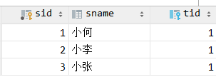
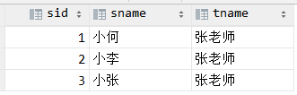

​​​​​​
一对多：==集合 #9C27B0==，一个老师有多个学生

多对一：==关联 #9C27B0==，多个学生关联一个老师

==student #F44336==


<font color="red">teacher</font>


sql语句查询学生和关联的老师

``` sql
select sid, sname,tname from mybatis_study.student s,mybatis_study.teacher t where s.tid=t.tid
```

